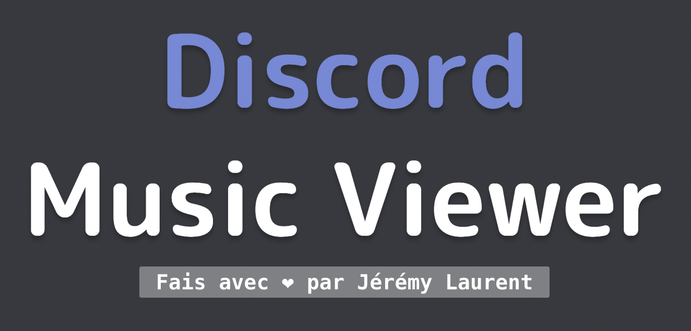

<div id="top"></div>

[![Contributors][contributors-shield]][contributors-url]
[![Forks][forks-shield]][forks-url]
[![Stargazers][stars-shield]][stars-url]
[![Issues][issues-shield]][issues-url]
[![MIT License][license-shield]][license-url]
[![LinkedIn][linkedin-shield]][linkedin-url]

<!-- PROJECT LOGO -->
<br />
<div align="center">
  <a href="https://github.com/PoulpY2K/leu-bot">
    
  </a>

<h3 align="center">LDU Bot</h3>

  <p align="center">
    LDU Bot est un bot Discord pour écouter de la musique et la visualiser grâce à une interface web.
    <br />
    <a href="https://github.com/PoulpY2K/leu-bot"><strong>Explorer la documentation »</strong></a>
    <br />
    <br />
    <a href="https://github.com/PoulpY2K/leu-bot">Voir démo</a>
    ·
    <a href="https://github.com/PoulpY2K/leu-bot/issues">Reporter des bugs</a>
    ·
    <a href="https://github.com/PoulpY2K/leu-bot/issues">Demander une fonctionnalité</a>
  </p>
</div>

<!-- TABLE OF CONTENTS -->
<details>
  <summary>Sommaire</summary>
  <ol>
    <li>
      <a href="#about-the-project">À propos du projet</a>
      <ul>
        <li><a href="#built-with">Construit avec</a></li>
      </ul>
    </li>
    <li>
      <a href="#getting-started">Pour commencer</a>
      <ul>
        <li><a href="#prerequisites">Prérequis</a></li>
        <li><a href="#installation">Installation</a></li>
      </ul>
    </li>
    <li><a href="#usage">Utilisation</a></li>
    <li><a href="#license">Licence</a></li>
    <li><a href="#contact">Contact</a></li>
  </ol>
</details>

<!-- ABOUT THE PROJECT -->

## À propos du projet

[![Screenshot du nom du produit][product-screenshot]](https://github.com/PoulpY2K/leu-bot)

<p align="right">(<a href="#top">Revenir au début</a>)</p>

### Built With

- [Next.js](https://nextjs.org/)
- [Discord.js](https://github.com/discordjs/discord.js)
- [Discord.ts](https://github.com/oceanroleplay/discord.ts)
- [Socket.io](https://github.com/socketio/socket.io)

<p align="right">(<a href="#top">Revenir au début</a>)</p>

<!-- GETTING STARTED -->

## Pour commencer

### Prérequis

- node

  ```sh
  node -v (> 14.0)
  ```

- Inviter le bot discord dans votre serveur :
  https://discord.com/api/oauth2/authorize?client_id=967098136315191336&permissions=140160396352&scope=bot%20applications.commands

### Installation

1. Cloner le dépôt
   ```sh
   git clone https://github.com/PoulpY2K/leu-bot.git
   ```
2. Installer les dépendances NPM

   ```sh
   cd bot
   npm install

   cd music-viewer
   npm install
   ```

3. Ajoutez le token du bot dans votre environnement

   ```sh
   export BOT_TOKEN="token"
   ```

   ```fish
   set BOT_TOKEN token
   ```

4. Lancez le bot et l'interface

   ```sh
   cd bot
   npm start

   cd music-viewer
   npm run dev
   ```

<p align="right">(<a href="#top">Revenir au début</a>)</p>

<!-- USAGE EXAMPLES -->

## Utilisation

### Récupérer les identifiants des serveurs et des salons Discord

Afin de récupérer vos identifiants de serveur et de salon (ils vous seront demandé dans l'application), il faut activer les options développeur dans vos paramètres Discord.

[![Screenshot des options développeur][discord-dev-screenshot]](https://github.com/PoulpY2K/leu-bot)

Une fois activés, vous pourrez simplement copier les identifiants en faisant un clic droit sur les éléments (serveur, channel, message, etc.) :

[![Screenshot des ID serveur][discord-server]](https://github.com/PoulpY2K/leu-bot)

[![Screenshot des ID salons][discord-channel]](https://github.com/PoulpY2K/leu-bot)

<p align="right">(<a href="#top">Revenir au début</a>)</p>

<!-- LICENSE -->

## Licence

Distribué sous la Licence MIT. Voir `LICENSE.md` pour plus d'informations.

<p align="right">(<a href="#top">Revenir au début</a>)</p>

<!-- CONTACT -->

## Contact

Jérémy Laurent - [@PoulpY2K](https://twitter.com/PoulpY2K) - contact@jeremy-laurent.com

Lien du projet: [https://github.com/PoulpY2K/leu-bot](https://github.com/PoulpY2K/leu-bot)

<p align="right">(<a href="#top">Revenir au début</a>)</p>

<!-- MARKDOWN LINKS & IMAGES -->
<!-- https://www.markdownguide.org/basic-syntax/#reference-style-links -->

[contributors-shield]: https://img.shields.io/github/contributors/PoulpY2K/leu-bot.svg?style=for-the-badge
[contributors-url]: https://github.com/PoulpY2K/leu-bot/graphs/contributors
[forks-shield]: https://img.shields.io/github/forks/PoulpY2K/leu-bot.svg?style=for-the-badge
[forks-url]: https://github.com/PoulpY2K/leu-bot/network/members
[stars-shield]: https://img.shields.io/github/stars/PoulpY2K/leu-bot.svg?style=for-the-badge
[stars-url]: https://github.com/PoulpY2K/leu-bot/stargazers
[issues-shield]: https://img.shields.io/github/issues/PoulpY2K/leu-bot.svg?style=for-the-badge
[issues-url]: https://github.com/PoulpY2K/leu-bot/issues
[license-shield]: https://img.shields.io/github/license/PoulpY2K/leu-bot.svg?style=for-the-badge
[license-url]: https://github.com/PoulpY2K/leu-bot/blob/main/LICENSE.txt
[linkedin-shield]: https://img.shields.io/badge/-LinkedIn-black.svg?style=for-the-badge&logo=linkedin&colorB=555
[linkedin-url]: https://www.linkedin.com/in/j%C3%A9r%C3%A9my-laurent-0986981b8/
[product-screenshot]: images/screenshot.png
[discord-dev-screenshot]: images/discord_dev.png
[discord-server]: images/discord_server.png
[discord-channel]: images/discord_channel.png
